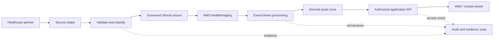

# AWS HealthOps

Secure healthcare data-exchange infrastructure for a managed-service provider (MSP) onboarding a specialty medical-imaging customer.

> **Status:** Lean MVP deployed in `us-east-1`. No real healthcare data or de-identified medical images have been uploaded.

## The problem

Specialty imaging teams receive medical studies and related healthcare files from hospitals, laboratories, and external vendors. Manual handoffs and flat file shares make it hard to validate an intake, limit access to the people who need it, preserve the clinical source of truth, or prove exactly how a derived 3D asset was created.

## The solution

AWS HealthOps provides a reusable, infrastructure-as-code foundation for secure file intake, data zoning, orchestration, auditability, and controlled delivery. The deployed MVP issues short-lived authenticated upload URLs, performs basic DICOM P10 routing, quarantines invalid inputs, records workflow provenance, and protects approved derived-asset delivery behind Cognito.

The original DICOM study remains in the controlled clinical-data zone. A segmentation and 3D asset are traceable derived outputs; they do not replace the clinical record.

## Target user

The primary operator is a healthcare MSP/cloud-operations team. Its customer users include imaging technicians, radiology or 3D-lab staff, researchers, and other authorized visualization users.

## Demonstrated outcome

An authorized partner can request a five-minute upload URL for a DICOM file. The platform checks the DICOM P10 marker before it routes the file to the clinical-source zone; an invalid `.dcm` is quarantined and recorded as an audit event. HealthImaging import completion then starts a provenance workflow, while the delivery API exposes only approved derived assets to authenticated users.

## Architecture

The editable diagram source is at [diagrams/aws-healthops-architecture.mmd](diagrams/aws-healthops-architecture.mmd). The design and its key decisions are described in [docs/architecture.md](docs/architecture.md). Use the [architecture learning map and narration](docs/architecture-learning-map.md) to follow each diagram area through AWS documentation and the portfolio story.

The deployed resources, their direct AWS Console links, verified proof points, and node-by-node video narration are in [docs/live-aws-console-links.md](docs/live-aws-console-links.md).



## Proposed AWS services

- AWS HealthImaging and DICOMweb APIs for medical-imaging studies.
- Amazon S3 for inbound, quarantine, clinical-source, derived, visualization, audit, and archive zones.
- Amazon EventBridge, AWS Step Functions, and AWS Lambda for event-driven validation and processing.
- Amazon API Gateway, Amazon Cognito, and AWS IAM for authenticated, least-privilege delivery.
- S3-managed encryption, AWS IAM, AWS CloudTrail event history, Amazon CloudWatch, lifecycle rules, and AWS Budgets for cost-safe controls and operations.

Amazon Bedrock and an on-demand SageMaker/MONAI segmentation workload are explicitly later phases, not MVP dependencies.

## Scope and safety boundaries

- Use only synthetic or appropriately licensed, de-identified demonstration data.
- Do not make diagnostic, clinical-decision, or HIPAA-compliance claims.
- The MVP uses a precomputed segmentation/derived model; a production implementation could run a versioned inference workload.
- The initial environment is one purpose-built demo account, while the production reference design supports workload isolation across accounts.

## Cost target

The MVP is designed to remain at or below **$0.05/day** by avoiding persistent endpoints and post-trial security services with a minimum monthly charge. See [docs/cost-guardrails.md](docs/cost-guardrails.md).

## Portfolio deliverables

- Architecture diagram and decision record.
- Terraform-based environment (deployed).
- A short demo showing successful intake, restricted delivery, policy enforcement, and audit trail.
- A 3–5 minute LinkedIn/portfolio video. See [docs/video-storyboard.md](docs/video-storyboard.md).
- Future extension: a CDISC-oriented clinical-trial data-reconciliation workload that uses the same governance foundation.

## Repository structure

```text
diagrams/   Editable architecture diagrams
docs/       Architecture, cost, and portfolio/demo documentation
infra/      Terraform implementation and synthetic test event
app/        Lambda handlers for intake, routing, provenance, and delivery
```
