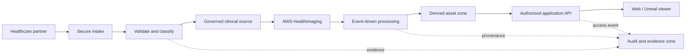

# AWS HealthOps

Secure healthcare data-exchange infrastructure for a managed-service provider (MSP) onboarding a specialty medical-imaging customer.

> **Status:** Architecture and portfolio-design phase. No AWS resources or real healthcare data have been created or used.

## The problem

Specialty imaging teams receive medical studies and related healthcare files from hospitals, laboratories, and external vendors. Manual handoffs and flat file shares make it hard to validate an intake, limit access to the people who need it, preserve the clinical source of truth, or prove exactly how a derived 3D asset was created.

## The solution

AWS HealthOps provides a reusable, infrastructure-as-code foundation for secure file intake, data zoning, orchestration, auditability, and controlled delivery. Its first showcase workload takes an appropriate synthetic or de-identified DICOM study through governed storage and processing to an approved 3D visualization asset.

The original DICOM study remains in the controlled clinical-data zone. A segmentation and 3D asset are traceable derived outputs; they do not replace the clinical record.

## Target user

The primary operator is a healthcare MSP/cloud-operations team. Its customer users include imaging technicians, radiology or 3D-lab staff, researchers, and other authorized visualization users.

## Demonstrated outcome

An authorized partner can submit a sample imaging study; the platform validates and governs it, records its lineage, processes it into an approved derived asset, and makes only that asset available to an authorized visualization client. An attempt to place source DICOM in the visualization zone is blocked or quarantined and recorded as a policy event.

## Architecture

The editable diagram source is at [diagrams/aws-healthops-architecture.mmd](diagrams/aws-healthops-architecture.mmd). The design and its key decisions are described in [docs/architecture.md](docs/architecture.md).



## Proposed AWS services

- AWS HealthImaging and DICOMweb APIs for medical-imaging studies.
- Amazon S3 for inbound, quarantine, clinical-source, derived, visualization, audit, and archive zones.
- Amazon EventBridge, AWS Step Functions, and AWS Lambda for event-driven validation and processing.
- Amazon API Gateway, Amazon Cognito, and AWS IAM for authenticated, least-privilege delivery.
- AWS KMS, AWS CloudTrail, Amazon CloudWatch, AWS Config, AWS Security Hub, Amazon GuardDuty, AWS Backup, and AWS Budgets for controls and operations.

Amazon Bedrock and an on-demand SageMaker/MONAI segmentation workload are explicitly later phases, not MVP dependencies.

## Scope and safety boundaries

- Use only synthetic or appropriately licensed, de-identified demonstration data.
- Do not make diagnostic, clinical-decision, or HIPAA-compliance claims.
- The MVP uses a precomputed segmentation/derived model; a production implementation could run a versioned inference workload.
- The initial environment is one purpose-built demo account, while the production reference design supports workload isolation across accounts.

## Cost target

The MVP is designed for **$0–$10/month**, with a personal review/teardown ceiling of $20/month. It intentionally excludes always-on AWS Transfer Family SFTP endpoints, NAT Gateways, and persistent ML endpoints. See [docs/cost-guardrails.md](docs/cost-guardrails.md).

## Portfolio deliverables

- Architecture diagram and decision record.
- Terraform-based environment (planned).
- A short demo showing successful intake, restricted delivery, policy enforcement, and audit trail.
- A 3–5 minute LinkedIn/portfolio video. See [docs/video-storyboard.md](docs/video-storyboard.md).
- Future extension: a CDISC-oriented clinical-trial data-reconciliation workload that uses the same governance foundation.

## Repository structure

```text
diagrams/   Editable architecture diagrams
docs/       Architecture, cost, and portfolio/demo documentation
infra/      Terraform implementation (planned)
app/        Demo application and workflows (planned)
```
